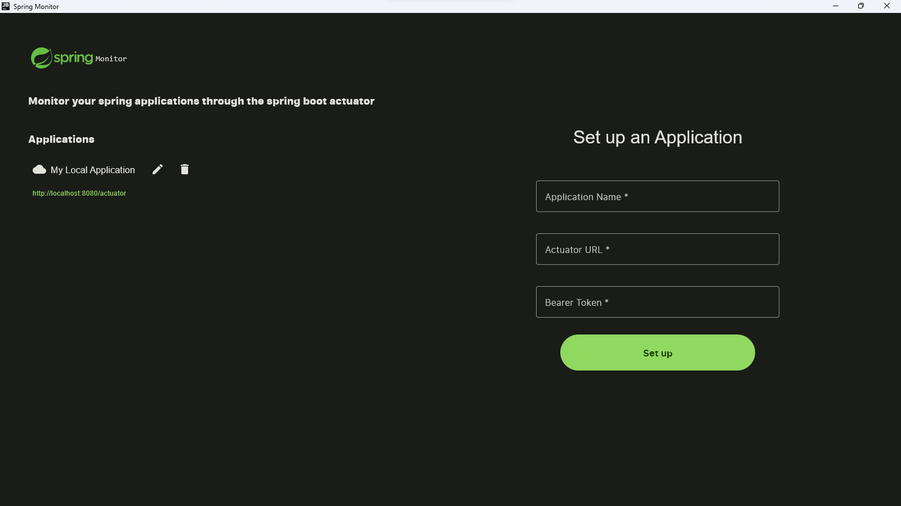
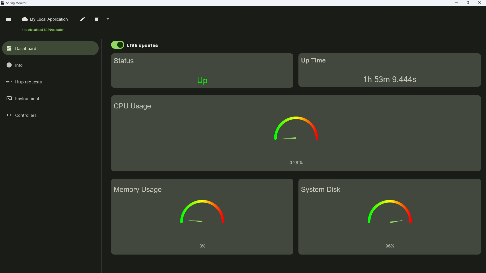
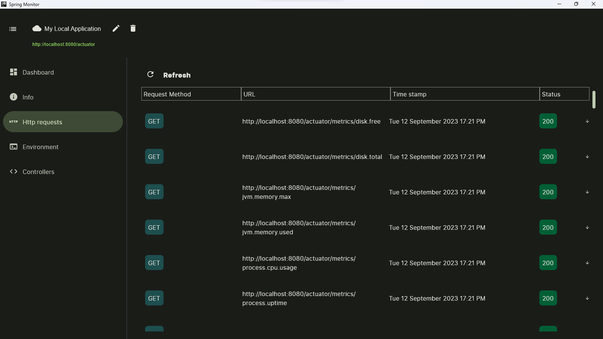

# Spring Monitor

A desktop application built with compose multiplatform that can be used to monitor you actuator enabled spring boot
applications.

## Current Features

#### System Metrics

<ul>
    <li>Application status </li>
    <li>Application Up Time</li>
    <li>CPU usage</li>
    <li>Memory usage</li>
    <li>System Disk</li>
</ul>

#### HTTP

<ul>
    <li>View HTTP trace (application must have an HTTPTraceRepository bean)</li>
</ul>
 

## Upcoming Features

#### Application info

<ul>
    <li>OS info</li>
    <li>Build info</li>
    <li>Git info</li>
    <li>Java info</li>
</ul>

#### View Environment variables

#### View Http Controllers

#### View Loggers

#### View Log file

 

## Screenshots

 

#### Set Up screen

 
 

#### Info dashboard

 
 

#### Http Trace

 
 

